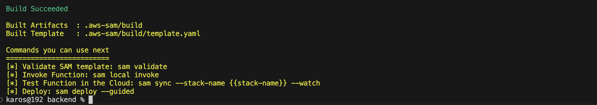
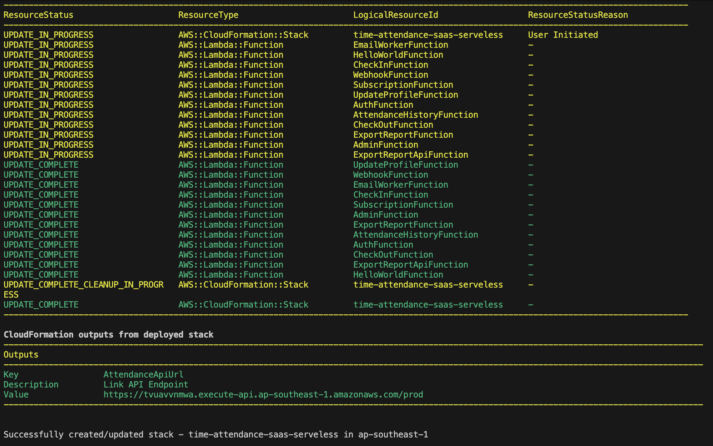

#### Triển khai hạ tầng Backend Serverless

Trong phần này, bạn sẽ đóng gói và triển khai toàn bộ **Backend Serverless** của hệ thống **Smart Attendance SaaS Platform** bằng **AWS Serverless Application Model (AWS SAM)**.

Hệ thống sau khi triển khai sẽ bao gồm:

+ Amazon Cognito User Pool
+ Amazon API Gateway HTTP API
+ AWS Lambda Microservices
+ Amazon DynamoDB (Single-Table Design)
+ AWS KMS Customer Managed Key
+ DynamoDB Streams
+ Các IAM Role và Policy cần thiết

---

#### 1. Kiểm tra mã nguồn hạ tầng (`template.yaml`)

File **template.yaml** khai báo toàn bộ hạ tầng AWS theo mô hình **Infrastructure as Code (IaC)**.

Các tài nguyên chính bao gồm:

+ **Amazon Cognito User Pool (`CognitoUserPool`)**  
  Quản lý đăng ký, đăng nhập và phát hành JWT Token. Đồng thời định nghĩa các thuộc tính tùy chỉnh như **tenantId** và **role** để hỗ trợ mô hình đa tenant.

+ **Amazon API Gateway HTTP API (`AttendanceApi`)**  
  Cung cấp các REST API và tích hợp **JWT Authorizer** để xác thực người dùng thông qua Amazon Cognito.

+ **AWS KMS Key (`DataKMSKey`)**  
  Tạo Customer Managed Key (CMK) dùng để mã hóa dữ liệu lưu trữ trên Amazon DynamoDB và Amazon S3.

+ **Amazon DynamoDB (`SaaSAttendanceTable`)**  
  Áp dụng mô hình **Single-Table Design** với **Partition Key (PK)** và **Sort Key (SK)**, sử dụng chế độ **On-Demand Billing** và bật **DynamoDB Streams**.

+ **AWS Lambda Functions**  
  Xử lý toàn bộ nghiệp vụ của hệ thống Smart Attendance SaaS.

Các Lambda Function bao gồm:

- **AuthFunction** – Xử lý đăng ký, đăng nhập và cấp JWT Token (`/auth/*`).
- **CheckInFunction** – Ghi nhận thời gian Check-in (`/attendance/check-in`).
- **CheckOutFunction** – Ghi nhận thời gian Check-out (`/attendance/check-out`).
- **AttendanceHistoryFunction** – Truy vấn lịch sử chấm công (`/attendance/history`).
- **AdminFunction** – Quản lý doanh nghiệp, nhân viên và Dashboard (`/admin/*`).
- **ReportFunction** – Tiếp nhận yêu cầu tạo báo cáo bất đồng bộ.
- **WebhookFunction** – Xử lý Webhook từ hệ thống bên ngoài và các thông báo hệ thống.

---

#### 2. Build ứng dụng Serverless

Di chuyển đến thư mục backend:

```bash
cd backend
```

Thực hiện build ứng dụng:

```bash
sam build
```

Sau khi build thành công, AWS SAM sẽ hiển thị kết quả tương tự:

```text
Build Succeeded

Built Artifacts : .aws-sam/build
Built Template  : .aws-sam/build/template.yaml
```



Các artifact sau khi build sẽ được lưu trong thư mục:

```text
.aws-sam/build
```

Đồng thời file template sau khi xử lý sẽ được tạo tại:

```text
.aws-sam/build/template.yaml
```

Các artifact này sẽ được AWS SAM sử dụng trong quá trình triển khai hạ tầng.

---

#### 3. Triển khai hạ tầng lên AWS

Thực hiện lệnh triển khai:

```bash
sam deploy --guided
```

Trong lần triển khai đầu tiên, AWS SAM sẽ yêu cầu nhập các tham số cấu hình:

```text
Configuring SAM deploy
======================

Stack Name [sam-app]: smart-attendance-backend
AWS Region [us-east-1]: ap-southeast-1
Parameter AllowedOrigin [https://your-cloudfront-domain.cloudfront.net]: https://localhost:3000
Parameter OriginVerifySecret [SaaS-Secure-Verification-Token-2026]: SaaS-Secure-Verification-Token-2026
Confirm changes before deploy [Y/n]: n
Allow SAM CLI IAM role creation [Y/n]: Y
Disable rollback [y/N]: N
Save arguments to configuration file [Y/n]: Y
SAM configuration file [samconfig.toml]: samconfig.toml
SAM configuration environment [default]: default
```

AWS SAM sẽ sử dụng **AWS CloudFormation** để tự động tạo hoặc cập nhật toàn bộ tài nguyên được định nghĩa trong file `template.yaml`.

Quá trình triển khai thường mất khoảng **2–5 phút** tùy theo số lượng tài nguyên.

Sau khi hoàn tất, màn hình sẽ hiển thị trạng thái triển khai của từng tài nguyên cùng với các giá trị Output của CloudFormation.



Thông báo thành công sẽ tương tự:

```text
Successfully created/updated stack
```

---

#### Khắc phục lỗi "S3 Bucket does not exist"

Trong quá trình triển khai, bạn có thể gặp lỗi:

```text
S3 Bucket does not exist
```

Nguyên nhân là CloudFormation Stack do AWS SAM quản lý vẫn còn tồn tại nhưng Deployment Bucket đã bị xóa thủ công.

Để khắc phục, thực hiện:

```bash
aws cloudformation delete-stack \
--stack-name aws-sam-cli-managed-default \
--region ap-southeast-1
```

Sau khi Stack được xóa hoàn toàn, triển khai lại:

```bash
sam deploy --guided
```

AWS SAM sẽ tự động tạo lại Deployment Bucket và tiếp tục quá trình triển khai.

---

#### 4. Lưu lại các giá trị Output

Sau khi triển khai thành công, CloudFormation sẽ hiển thị các Output của Stack.

Ví dụ:

```text
Key                 AttendanceApiUrl
Description         API Endpoint URL
Value               https://xxxxxxx.execute-api.ap-southeast-1.amazonaws.com/prod
```

```text
Key                 CognitoUserPoolId
Description         Cognito User Pool ID
Value               ap-southeast-1_xxxxxxxxx
```

```text
Key                 CognitoUserPoolClientId
Description         Cognito App Client ID
Value               xxxxxxxxxxxxxxxxxxxxxxxxxxx
```

Hãy lưu lại các giá trị sau:

+ **AttendanceApiUrl**
+ **CognitoUserPoolId**
+ **CognitoUserPoolClientId**

Các giá trị này sẽ được sử dụng để cấu hình ứng dụng React SPA ở phần tiếp theo.

Ví dụ file `.env.production`:

```env
VITE_API_BASE_URL=https://xxxxxxx.execute-api.ap-southeast-1.amazonaws.com/prod
VITE_COGNITO_USER_POOL_ID=ap-southeast-1_xxxxxxxxx
VITE_COGNITO_CLIENT_ID=xxxxxxxxxxxxxxxxxxxxxxxxxx
VITE_AWS_REGION=ap-southeast-1
```

---

#### Tổng kết

Sau khi hoàn thành phần này, bạn đã:

+ Kiểm tra file hạ tầng `template.yaml`.
+ Hiểu các tài nguyên AWS được triển khai.
+ Build ứng dụng bằng `sam build`.
+ Triển khai Backend bằng `sam deploy --guided`.
+ Tạo thành công các dịch vụ Amazon Cognito, API Gateway, Lambda, DynamoDB và AWS KMS.
+ Lưu lại các giá trị Output để sử dụng trong bước triển khai Frontend.

Backend của hệ thống **Smart Attendance SaaS Platform** đã sẵn sàng để tiếp tục cấu hình cơ sở dữ liệu, xây dựng quy trình xử lý bất đồng bộ và tích hợp với ứng dụng React ở các phần tiếp theo.